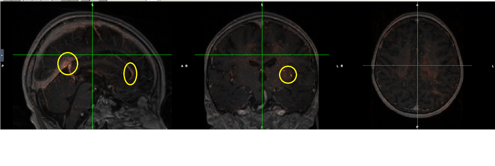

# loes-scoring-explainability

This program creates a NIFTI file showing the degrees of saliency of voxels in calculating the Loes score of the input anatomical file.
The [Captum library](https://captum.ai/api/saliency.html) is used for this.

A baseline approach for computing input attribution. It returns absolute values of the gradients with respect to inputs. 

More details about the approach can be found in the following paper:
[Deep Inside Convolutional Networks: Visualising Image Classification Models and Saliency Maps](https://arxiv.org/abs/1312.6034)
by Karen Simonyan, Andrea Vedaldi, and Andrew Zisserman.

The program takes three arguments:
* input: the file path of the input NIFTI file
* input: the file path of the model file
* output: the file path of the saliency NIFTI file to be created

Here is an example invocation:

`python saliency.py input.nii.gz output.nii.gz loes_scoring_03.pt`

There is a virtual environment here that contains all the necessary dependencies:

*/home/miran045/reine097/projects/loes-scoring-explainability/venv*

The output NIFTI saliency map can be used as an overlay for the original NIFTI file and be viewed in a NIFTI viewer such as FSLeyes.

