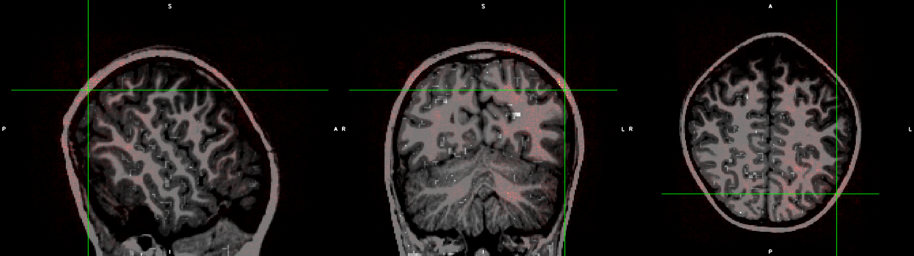
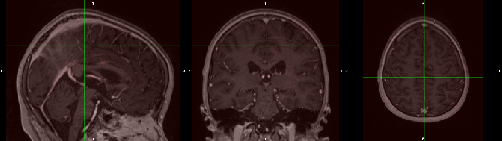
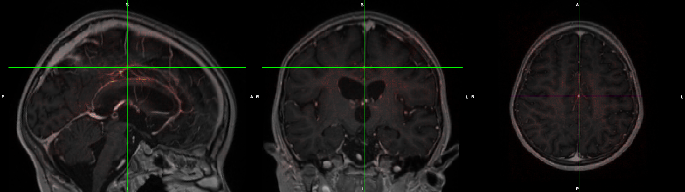

Saliency example files
======================

* Location of saliency maps
  * /home/feczk001/shared/projects/S1067_Loes/data/MNI-space_Loes_data_saliency

Low Loes score example
----------------------

* Original MRI file
  * `/home/feczk001/shared/projects/S1067_Loes/data/MNI-space_Loes_data/sub-7151DOBU_ses-20170303_space-MNI_mprage.nii.gz`
* Saliency file
  * `/home/feczk001/shared/projects/S1067_Loes/data/MNI-space_Loes_data_saliency/sub-7151DOBU_ses-20170303_space-MNI_mprage_salience.nii.gz`
* loes-score
  * 1.0
* max-saliency
  * 4.93513552916546
* max-saliency-x
  * 38
* max-saliency-y
  * 56
* max-saliency-z
  * 122
* prediction
  * 3.303957223892212
* error
  * 2.303957223892212

Medium Loes score example
----------------------

* Original MRI file
  * `/home/feczk001/shared/projects/S1067_Loes/data/MNI-space_Loes_data/sub-6605ALCA_ses-20160824_space-MNI_mprageGd.nii.gz` 
* Saliency file
  * `/home/feczk001/shared/projects/S1067_Loes/data/MNI-space_Loes_data_saliency/sub-6605ALCA_ses-20160824_space-MNI_mprageGd.nii.gz`
* loes-score
  * 7.0
* max-saliency
  * 6.611084556288833
* max-saliency-x
  * 96
* max-saliency-y
  * 104
* max-saliency-z
  * 128
* prediction
  * 3.3373489379882812
* error
  * 3.6626510620117188

High Loes score example
-----------------------

* Original MRI file
  * `/home/feczk001/shared/projects/S1067_Loes/data/MNI-space_Loes_data/sub-6630SICH_ses-20160727_space-MNI_mprageGd.nii.gz` 
* Saliency file
  * `/home/feczk001/shared/projects/S1067_Loes/data/MNI-space_Loes_data_saliency/sub-6630SICH_ses-20160727_space-MNI_mprageGd_salience.nii.gz`
* loes-score
  * 21.0
* max-saliency
  * 6.1555011325010245
* max-saliency-x
  * 96 
* max-saliency-y
  * 116 
* max-saliency-z
  * 122 
* prediction
  * 3.3655340671539307 
* error
  * 17.63446593284607
